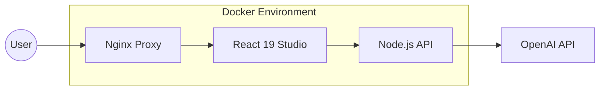

# LLM-Powered Chart Maker

A full-stack application designed to transform unstructured text and PDF documents into professional Mermaid.js diagrams using Large Language Models. This project serves as a demonstration of high-performance PDF rendering, automated text extraction, and AI-driven visualization pipelines.

## Technologies

- **Frontend**: React 19, TypeScript, Vite, PDF.js (v5+), Mermaid.js
- **Backend**: Node.js, Express, TypeScript, OpenAI API
- **DevOps**: Docker, Docker Compose, Nginx

## Core Features

- **Document Analysis Studio**: Custom canvas-based PDF renderer with a native text layer for seamless content selection.
- **AI Magic Sync**: Real-time selection tracking that automatically synchronizes highlighted document content with the diagram generator.
- **Intelligent Diagramming**: Automated conversion of complex text into Flowcharts, Timelines, and Rules Maps via OpenAI's GPT models.
- **Premium Workspace**: Modern, glassmorphism-inspired UI with a Cinema-Mode document viewer and responsive diagram canvas.

## Setup Instructions

1. **Configuration**: Create a `.env` file in the root directory and add your `OPENAI_API_KEY`.
2. **Deployment**: Execute `docker-compose up -d --build` to initialize the environment.
3. **Usage**: Access the workspace at `http://localhost:3000`.

## Explanation of Approach

The project addresses the friction between static document analysis and dynamic visualization through two primary engineering innovations.

### System Architecture
The application is deployed as a multi-container environment orchestrated via Docker, ensuring consistent behavior across all stages of the analysis lifecycle:

### Custom Rendering Engine
Standard PDF integration via iframes prevents programmatic access to content due to browser security models. This project implements a custom pipeline using **PDF.js v5** that renders pages onto a high-resolution canvas. A transparent text layer is mapped over the canvas, enabling the **AI Magic Sync** selection mechanism. This allows users to synchronize document context to the AI generator in real-time without manual copy-pasting.

### LLM Orchestration
The backend acts as an intelligent middleware, sanitizing selection data and injecting it into optimized prompt schemas. It handles:
- **Syntax Integrity**: Ensuring output conforms to Mermaid.js standards.
- **Context Management**: Passing user-selected highlights as domain knowledge.
- **Fail-Safe Generation**: Robust error handling for API latency and validation.

## Usability and Design

The application prioritizes a "Studio" experience, moving beyond standard form-based inputs to an immersive workspace:
- **Visual Clarity**: High-contrast, dark-mode "Cinema" interface reduces eye strain during long analysis sessions.
- **Frictionless Workflow**: Selection-based synchronization eliminates the need for manual copy-pasting.
- **Glassmorphism UI**: Modern aesthetic utilizing depth and blur to create a premium environment.

## Smarter RAG Roadmap (Future Vision)

A primary objective for future iterations is the implementation of a sophisticated RAG (Retrieval-Augmented Generation) pipeline:
- **Dense Document Support**: Optimized for high-density casebooks and extensive legal syllabi.
- **Semantic Precision**: Reliable, context-aware answers across dozens of source documents simultaneously.
- **Contextual Insight**: Enabling detailed, cross-document questions and authoritative visualizations.

## Development and Security

The project adheres to modern engineering standards for high-performance personal projects:
- **TypeScript Integration**: Full-stack type safety ensuring reliable data flow between the React 19 frontend and Node.js backend.
- **Security Posture**: Regularly audited dependencies with zero high-severity vulnerabilities in the current build.
- **Containerized Excellence**: Standardized Docker orchestration for consistent environment behavior across development and production.

## License

This project is open-source and available under the MIT License.
