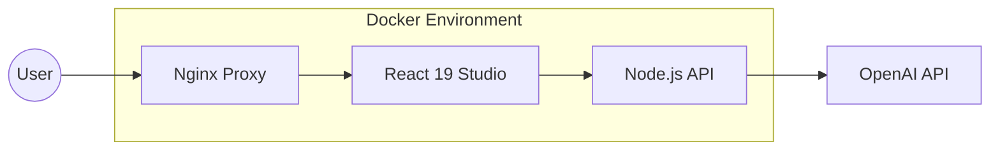

# LLM-Powered Chart Maker

A full-stack application designed to transform unstructured text and PDF documents into professional Mermaid.js diagrams using Large Language Models. This project serves as a demonstration of high-performance PDF rendering, automated text extraction, and AI-driven visualization pipelines.

## Technologies

- **Frontend**: React 19, TypeScript, Vite, PDF.js (v5+), Mermaid.js
- **Backend**: Node.js, Express, TypeScript, OpenAI API
- **DevOps**: Docker, Docker Compose, Nginx

## Core Features

- **Document Analysis Studio**: Custom canvas-based PDF renderer with a native text layer and **Lazy-Loading** for high-performance handling of extensive 100+ page documents.
- **AI Research Bin**: A persistent "Context Bin" that allows users to collect multiple highlights from across the document before synthesizing them into a single diagram.
- **AI Magic Sync**: Real-time selection tracking that automatically synchronizes highlighted document content with the diagram generator.
- **Pro Export Suite**: One-click professional exports for **PNG (High-Res)**, **SVG (Vector)**, and raw Mermaid code for seamless integration into presentations and reports.
- **Premium Workspace**: Modern, glassmorphism-inspired UI with a Cinema-Mode document viewer and high-contrast dark mode.

## Setup Instructions

1. **Configuration**: Create a `.env` file in the root directory and add your `OPENAI_API_KEY`.
2. **Deployment**: Execute `docker-compose up -d --build` to initialize the environment.
3. **Usage**: Access the workspace at `http://localhost:3000`.

## Explanation of Approach

The project addresses the friction between static document analysis and dynamic visualization through three primary engineering innovations.

### System Architecture
The application is deployed as a multi-container environment orchestrated via Docker, ensuring consistent behavior across all stages of the analysis lifecycle:

### Custom Rendering Engine & Performance
Standard PDF integration via iframes prevents programmatic access to content. This project implements a custom pipeline using **PDF.js v5** that renders pages onto a high-resolution canvas. 
- **Lazy Loading**: Implements `IntersectionObserver` logic to only render pages in the viewport, maintaining a low memory footprint even for massive documents.
- **Vite Worker Injection**: Uses native Vite worker loaders to run the rendering engine in a dedicated background thread, ensuring a lag-free UI.

### AI Orchestration & Research Bin
The backend acts as an intelligent middleware, sanitizing selection data and injecting it into optimized prompt schemas.
- **Context Pooling**: The "Research Bin" allows for non-linear document analysis, where multiple disparate snippets can be combined into a single, cohesive visualization.
- **Syntax Integrity**: Ensuring output conforms to Mermaid.js standards.
- **Fail-Safe Generation**: Robust error handling for API latency and validation.

## Smarter RAG Roadmap (Future Vision)

A primary objective for future iterations is the implementation of a sophisticated RAG (Retrieval-Augmented Generation) pipeline:
- **Generalized Dense Document Support**: Optimized for high-density technical manuals, academic whitepapers, and extensive multi-page reports.
- **Semantic Precision**: Reliable, context-aware answers across dozens of source documents simultaneously using vector embeddings.
- **Cross-Document Synthesis**: Enabling detailed, multi-source questions and authoritative visualizations that pull data from an entire library of PDFs.

## Development and Security

The project adheres to modern engineering standards for high-performance personal projects:
- **TypeScript Integration**: Full-stack type safety between the React 19 frontend and Node.js backend.
- **Security Posture**: Regularly audited dependencies with zero high-severity vulnerabilities in the current build.
- **Containerized Excellence**: Standardized Docker orchestration for consistent environment behavior.

## License

This project is open-source and available under the MIT License.
